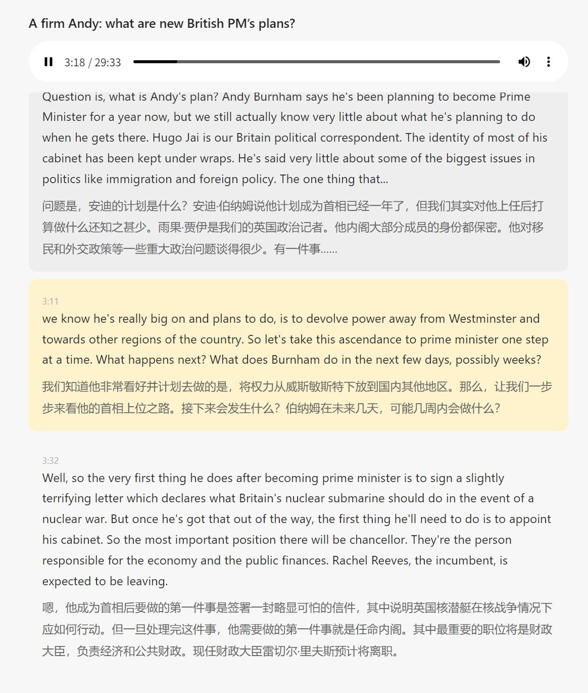
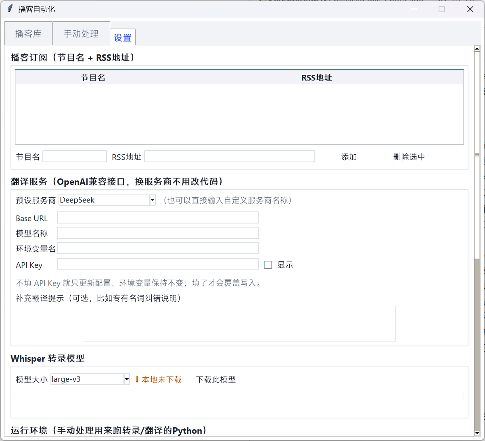
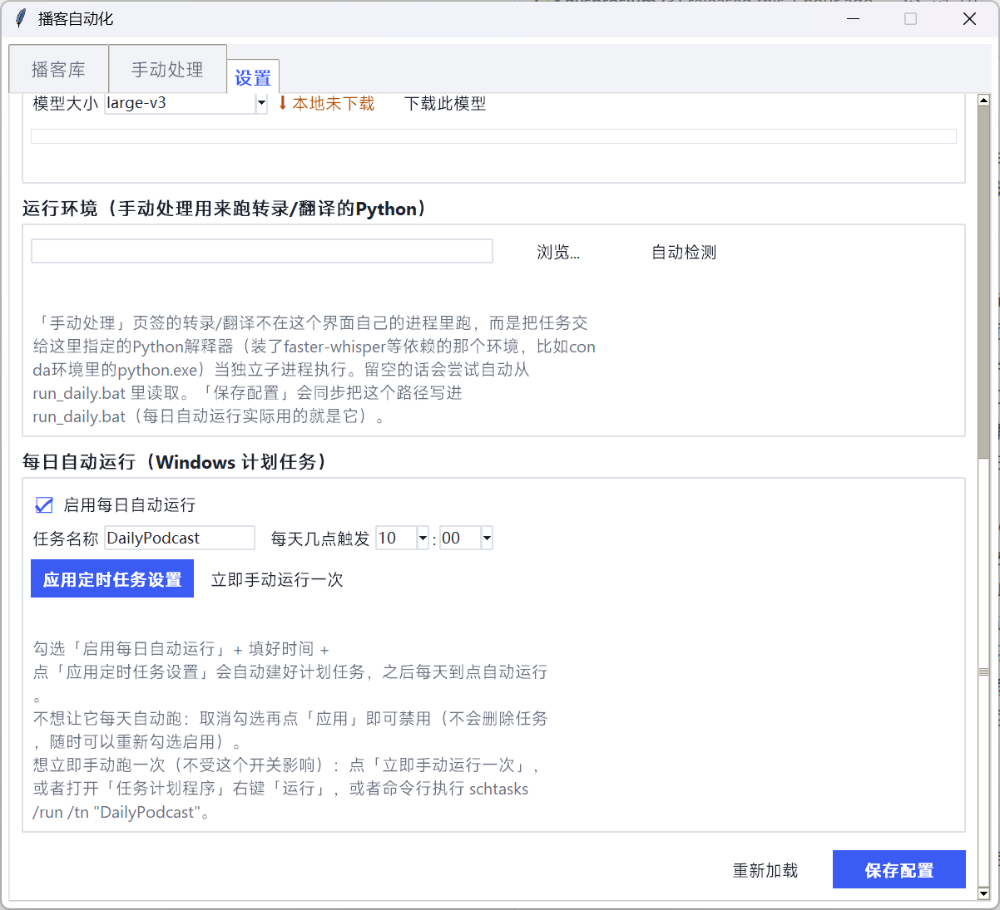

# whisper-project：本地音频转录 + 双语翻译工具（Windows）

把任意英文音频——播客、讲座录音、访谈、随便什么——用你自己的本地 GPU 转录成文字，调用你配置的翻译服务生成中文对照，最后产出一个可点击跳转播放的双语字幕网页。音频全程留在本地，不上传到任何地方。

支持两种典型用法：

- **批量转录学习材料**：手头攒了一堆英文播客/讲座音频想转成双语字幕方便学习，用「手动处理」一次性导入一批本地文件、或者从某个播客的历史里挑几期，排队批量转录+翻译
- **全自动播客流水线**：订阅几个播客的 RSS，Windows 计划任务每天自动检查更新、下载、转录、翻译，全程无人值守，跑完弹通知

两种用法走的是同一套转录/翻译引擎，区别只在于"音频从哪来"——手动挑 / 批量导入，还是 RSS 自动抓取。

最终产出长这样——带音频播放器的双语字幕页，点哪句字幕就跳到哪句，当前播放到的句子会高亮：



## 快速开始：图形界面（推荐）

推荐无论哪种用法都从这里开始——不用碰配置文件，两种场景在同一个界面里都能覆盖到。如果你更习惯命令行，跳到最后的[《不用图形界面》](#不用图形界面纯命令行)。

### 第1步：确认环境

- Windows 10/11
- NVIDIA 显卡（本地转录要用 CUDA 跑 GPU 推理），显存大小决定能跑动哪个模型。网上常见的"large需要10GB"之类的数字大多是针对 OpenAI 官方原版 Whisper（PyTorch）说的，本项目用的 faster-whisper 底层是 CTranslate2 推理引擎，同样是 `large-v2` 模型，[官方benchmark](https://github.com/SYSTRAN/faster-whisper#benchmark) 实测显存占用是：

  | 实现 | 精度 | 显存占用 |
  |---|---|---|
  | openai/whisper | fp16 | 4708MB |
  | faster-whisper | fp16 | 4525MB |
  | faster-whisper | int8 | 2926MB |

  本项目用的正是 `float16`，所以 `large-v3` 实际只需要大约 4.5GB 显存，比网上流传的数字低不少（8GB 显存跑起来很轻松，这也是实测确认过的）。这张官方表只测了 large-v2，其它更小的模型显存占用会更低，具体不确定的话直接选来试一下最直接。
- 一个翻译服务的 API Key，比如 [DeepSeek](https://platform.deepseek.com/)（注册后在控制台生成一个 Key，等下第4步会用到；换成 OpenAI/Moonshot 等其他服务商也可以）

### 第2步：装好运行环境

不管你打算用命令行还是图形界面，转录/翻译本身都需要一个装好依赖的 Python 环境——**图形界面只是操作面板，真正干活的还是这一步装的环境**。

1. 装 [Miniconda](https://docs.conda.io/en/latest/miniconda.html)（推荐用 conda，理由见下面的提示框），建一个专用环境：

   ```bat
   conda create -n whisper-env python=3.11
   conda activate whisper-env
   ```

2. **装好 CUDA 运行库**——这一步很容易被忽略，但没它转录会直接报错崩溃。`pip install faster-whisper` 并不会带上它依赖的 cuBLAS / cuDNN 这些 CUDA 运行库，必须单独装：

   ```bat
   conda install -c conda-forge cudnn libcublas cuda-nvrtc
   ```

3. 克隆本仓库，装 Python 依赖：

   ```bat
   pip install -r requirements.txt
   ```

4. 复制配置模板：

   ```bat
   copy config.example.json config.json
   ```

5. Whisper 转录模型不需要手动下载，第一次用的时候会自动从 Hugging Face 下载好并缓存（下一步图形界面里也能手动点下载、看进度）。显卡显存不够的话可以换小一点的模型（`medium`、`small`、`base.en` 等），第4步里选。

> **模型默认从国内镜像下载**：huggingface.co 国内经常连不上/巨慢，代码里已经默认把下载走的地址设成了 [hf-mirror.com](https://hf-mirror.com)，不用你自己配置。如果你在海外、或者就是想用官方源，自己设一下环境变量覆盖掉默认值就行（跟 API Key 那个 `setx` 一样，只对**之后新打开**的终端/程序生效）：
>
> ```bat
> setx HF_ENDPOINT https://huggingface.co
> ```

> **为什么推荐 conda 而不是纯 pip venv**：CUDA 运行库在 Windows 上不好装——完整装 NVIDIA CUDA Toolkit 版本要跟 ctranslate2（faster-whisper 的推理引擎）编译时用的版本精确匹配，很容易踩坑；conda-forge 把这些库打成了普通 conda 包，装起来跟装其他 Python 包没区别，版本也管理得比较省心。如果你不想用 conda，也可以试试 pip 装 `nvidia-cublas-cu12`、`nvidia-cudnn-cu12` 这类官方 CUDA 轮子，但没有像 conda 这条路验证得那么充分。

> **遇到 `cublas64_12.dll` / `cudnn64_9.dll` 之类"找不到 xxx.dll"的报错**：最常见的原因不是没装好，而是**运行时没有激活这个 conda 环境**（比如直接双击/用绝对路径调用 `python.exe`，跳过了 `conda activate`）——conda 环境的 `Library\bin`（DLL 所在目录）要靠激活脚本加进 PATH，不激活就找不到。确认每次运行前都执行过 `conda activate whisper-env`（或者用 `run_daily.bat`/图形界面这些已经处理好这一步的入口）。
>
> 排查时注意：下面这行自检**只能证明 DLL 文件本身能被找到，不能完全排除问题**——它在没激活环境时也可能通过，因为 ctranslate2 真正调用 cublas 是在实际转录那一刻（懒加载），比这行自检更晚：
>
> ```bat
> python -c "import ctypes; ctypes.WinDLL('cublas64_12.dll'); print('OK')"
> ```
>
> 真要确认整条链路没问题，最好还是直接跑一次 `python daily_podcast.py`（在激活好的环境里）或者用「手动处理」实际转录一段音频。如果自检能过但转录时仍然报这个错，几乎可以确定就是没激活环境。

### 第3步：打开图形界面

```bat
python setup_wizard.py
```

或者不想碰命令行：去 [Releases](../../releases) 页面下载打包好的 `podcast-manager.exe`，放在项目根目录（跟 `config.json` 同一层）双击打开。首次打开 exe 时 Windows 可能会先扫描一下，等个几秒到几十秒，之后就快了。

`python setup_wizard.py` 和 `podcast-manager.exe` 打开的是**同一个界面、功能完全一样**，区别只在于怎么启动：前者要先激活好第2步的 conda 环境再跑（用的就是那个环境自己的 Python），后者是打包好的独立程序，双击就能开、不需要先激活环境。但两者本身都**只是个轻量的配置/管理面板**——真正的转录/翻译工作，不管走哪种方式打开界面，最终都是交给第2步装好的那个 Python 环境（通过子进程调用执行），所以第2步终究是不能省的，exe 也不会把 faster-whisper 这些转录依赖打包进去。

打开后是三个页签：**播客库**（浏览已经生成的内容，第一次打开是空的）、**手动处理**、**设置**——现在去 **设置** 页签。

### 第4步：在「设置」页签里填好这几样




1. **翻译服务**：下拉选个预设（比如 DeepSeek），把第1步拿到的 API Key 粘贴进去
2. **Whisper 转录模型**：选个模型大小，点「下载此模型」（如果还没下载好的话）
3. **播客订阅**（只想批量转录本地文件的话可以跳过这一项）：节目名随便起（会用作文件夹名），RSS 地址填播客的订阅源
4. **每日自动运行**（同样，只做批量转录可以跳过）：勾选「启用每日自动运行」，选好每天几点跑，点「应用定时任务设置」——这一步会自动帮你建好 Windows 计划任务，不用再去系统的任务计划程序里手动配置
5. 最下面点 **保存配置**

### 第5步：按你的场景开始用

**批量转录学习材料**：去「手动处理」页签——

- 「单个文件」：选一个本地音频文件，填个节目名和标题，点「开始转录+翻译」
- 「批量本地导入」：选一个装了一堆音频的文件夹（或者一个 zip 压缩包），勾选要处理的文件，一次性排队批量转录+翻译
- 「RSS历史下载」：如果是某个播客的历史内容，可以把整个 RSS 的历史列表拉出来，勾选任意几期批量下载处理，不受限于"只能拿到最新一期"

批量场景支持排队依次处理（GPU 一次只能处理一个）、随时取消剩余排队项，已经处理过的会先问一遍是否覆盖。跑完回到「播客库」页签就能看到，点「打开字幕页」看效果。

**全自动播客流水线**：确认第4步里播客订阅和每日自动运行都配置好了，就完成了。

正式交给它每天自动跑之前，建议先像上面「批量转录学习材料」那样，在「手动处理」的「单个文件」里随便测一个本地音频，确认转录/翻译整条链路、以及第一次加载 GPU 模型都能正常跑通——「设置」页签里的「立即手动运行一次」不能替代这一步：它跑的是真实的 RSS 检查，如果订阅的节目当天恰好没有新一期，就只会看到"暂无新一期"，根本不会真的走一遍下载/转录/翻译。

测试通过之后，以后每天到点会依次看到这些提示（也可以用「立即手动运行一次」提前触发一次真实检查，不用等到点）：

1. 如果检测到你正在玩全屏游戏，会静默推迟，不弹任何东西打扰你
2. 弹一条确认通知——"今天的播客抓取即将开始"，可以点"取消今天 / 延后30分钟 / 延后60分钟 / 立即开始"，不操作的话10分钟后自动开始
3. 依次检查每个订阅的节目：没有新一期的会弹一条"暂无新一期"；发现新一期会弹"发现新一期，开始处理"
4. 第一次要用到 GPU 模型时，会弹一个转圈等待的悬浮小窗（加载模型，一般1-2分钟）
5. 加载完开始正式处理，悬浮窗变成实时进度条：下载 → 转录 → 翻译
6. 处理完成，悬浮窗变绿，同时弹一条完成通知，点击能直接打开生成的字幕页（这一步不保证100%可靠，见下方特性一览里的说明；打不开的话直接去「播客库」页签找就行）

## 特性一览

- **本地转录**：用 [faster-whisper](https://github.com/SYSTRAN/faster-whisper) 在你自己的 GPU 上跑，音频不用上传到任何地方
- **不局限于播客**：单个文件转录、批量导入本地音频归档、播客 RSS 历史批量下载、全自动 RSS 监控，同一套引擎，按需选用
- **可插拔翻译服务商**：翻译走 OpenAI 兼容接口，DeepSeek / OpenAI / Moonshot / 智谱等大部分服务商都能直接用，改配置就行，不用改代码
- **全自动播客模式下不抢显卡**：检测到你在玩全屏游戏会自动推迟，运行前还有一条可交互的确认通知（取消/延后/立即开始）
- **原生桌面反馈**：Windows Toast 通知 + 自绘悬浮进度窗（转圈等待 → 下载/转录/翻译进度条 → 完成变绿），不是网页或命令行输出。完成通知支持点击直接打开字幕页，不过这条依赖运行转录的进程在通知弹出后还短暂存活着去接收点击事件——没有给这个工具注册真正的系统级应用身份（那需要一整套安装包才有的东西），所以不保证任何时候点都有效，打不开的话去「播客库」页签找就行
- **双语字幕播放页**：生成的 `subtitles.html` 带音频播放器，点哪句字幕就跳到哪句，中英对照
- **图形化管理界面**：`setup_wizard.py` / `podcast-manager.exe`——
  - **播客库**：浏览已生成的内容，直接打开字幕页 / 音频 / 所在文件夹
  - **手动处理**：单个本地文件转录翻译；把某个节目（或临时粘贴的RSS地址）的完整历史列出来，勾选任意几期批量下载处理；选一个文件夹或zip压缩包批量导入本地音频归档。批量场景支持排队处理、随时取消剩余、开始前一次性询问是否覆盖已处理内容
  - **设置**：翻译服务商、模型下载、播客订阅、计划任务开关，全部和 `config.json` 保持同步，不用手动改配置文件；每个页签内容较多时会自动带滚动条，不受屏幕分辨率限制
  - 界面进程和实际执行转录/翻译的进程是分开的（管理界面很轻量，重活交给子进程做），所以不管是 `python setup_wizard.py` 还是打包的 exe，启动都很快，也不存在"exe里缺CUDA库"的问题

## 配置文件参考（`config.json`）

图形界面会帮你生成和维护这个文件，一般不需要手动改，这里只是给想直接编辑或者想了解每个字段含义的人看：

```jsonc
{
  "feeds": {
    "节目显示名": "RSS地址"
  },
  "whisper_model_size": "large-v3",  // 对应 models/ 下的文件夹名
  "python_exe": "",                  // 可选：手动处理/计划任务用来跑转录/翻译的真实python.exe路径，
                                      // 留空会自动探测；保存配置时也会同步写进 run_daily.bat
  "translation": {
    "provider_name": "DeepSeek",           // 只用于日志/展示
    "base_url": "https://api.deepseek.com", // OpenAI兼容接口地址
    "api_key_env": "DEEPSEEK_API_KEY",      // 从哪个环境变量读API Key
    "model": "deepseek-v4-flash",
    "extra_system_prompt": ""               // 可选：针对某个播客的专有名词纠错说明等
  }
}
```

`feeds` 只有做全自动播客流水线才需要，想加几个节目就加几个，key 会同时用作文件夹名和通知里的显示名；只做批量转录本地文件的话可以留空。`extra_system_prompt` 是留给你补充的翻译提示（比如某个播客主持人的名字容易被语音识别听错，可以在这里说明），不填就用通用翻译提示词。

如果想手动指定 Whisper 模型文件（比如离线环境、或者已经下载好了别的来源的模型），把模型文件夹放到 `models/<模型名>/` 下面（需要包含 `model.bin`、`config.json`、`tokenizer.json`、`vocabulary.json` 等文件），程序会优先用本地文件夹，不会再走自动下载。

## 目录结构（生成的内容在哪）

这些文件夹都是程序自动创建的，不用你自己手动建——`episodes/` 本身、每个节目的子文件夹、每一期的子文件夹，跑的时候会自动按需建好：

```
episodes/节目名/期数标题/
  audio.mp3          原始音频
  data.json           带时间戳的逐句中英文
  transcript_en.txt   纯英文稿
  transcript_zh.txt   纯中文稿
  subtitles.html      双语字幕播放页（打开这个看/听）
```

## 不用图形界面，纯命令行

如果不想用图形界面，装好[第2步](#第2步装好运行环境)的环境之后可以全程手动。

装好环境之后先编辑 `config.json`（字段说明见上方[《配置文件参考》](#配置文件参考configjson)），设置翻译服务的 API Key 环境变量（默认是 `DEEPSEEK_API_KEY`，具体看你 `config.json` 里的 `translation.api_key_env`）：

```bat
setx DEEPSEEK_API_KEY "你的key"
```

### 批量转录学习材料

手动处理单个音频文件（不依赖 RSS，`--source-type` 还支持 `download`/`zip`，分别对应给一个下载链接 / `zip路径::压缩包内文件名`）：

```bat
python daily_podcast.py --manual-job --show "节目名" --title "期数标题" --source-type local --source "C:\音频\某期.mp3"
```

跑完会在 `episodes/节目名/期数标题/` 下生成跟图形界面一样的一整套文件（`subtitles.html` 等）。想批量处理一堆文件的话，写个小脚本循环调用这条命令就行——图形界面的「批量本地导入」本质上也是这么做的。

### 全自动播客流水线

1. 手动跑一次确认没问题（会按 `config.json` 里配置的 `feeds` 逐个检查更新）：

   ```bat
   python daily_podcast.py
   ```

2. 设置每日自动运行（Windows 计划任务）：

   1. 打开「任务计划程序」，新建任务
   2. 触发器设成你想要的时间（比如每天早上10点）
   3. 操作设成启动程序，目标填 `run_hidden.vbs` 的完整路径（这个文件会静默运行、不弹黑框）
   4. 保存后可以在任务计划程序里右键「运行」手动测试一次，或者命令行执行 `schtasks /run /tn "任务名"`

   `run_hidden.vbs` → `run_daily.bat`（设置好 Python 环境的 PATH）→ `prompt_before_run.py`（弹确认通知，10分钟不操作自动开始）→ `daily_podcast.py`（真正干活）。项目文件夹整体挪动位置不需要改这几个脚本，只有计划任务里配置的目标路径需要跟着手动改一次。如果你不用 conda，把 `run_daily.bat` 开头那几行换成你自己的 Python 环境激活方式即可。

### 自己重新打包 exe

`pip install pyinstaller` 之后跑：

```bat
pyinstaller --onefile --windowed --name podcast-manager setup_wizard.py ^
  --add-binary "<conda环境>\Library\bin\tcl86t.dll;." ^
  --add-binary "<conda环境>\Library\bin\tk86t.dll;." ^
  --add-binary "<conda环境>\Library\bin\liblzma.dll;." ^
  --add-binary "<conda环境>\Library\bin\libbz2.dll;." ^
  --add-binary "<conda环境>\Library\bin\ffi.dll;." ^
  --add-binary "<conda环境>\Library\bin\libexpat.dll;." ^
  --add-binary "<conda环境>\Library\bin\sqlite3.dll;."
```

这几个 `--add-binary` 是因为 conda 环境的 tcl/tk 等运行时 DLL 不在 PyInstaller 默认能找到的位置，不加的话打包出来的 exe 会因为缺 DLL 打不开界面。

## 其他

- `transcribe.py` 是早期写的一个单文件转录小例子，不属于自动化主流程，仅供参考
- 项目文件夹整体挪动位置（换盘符/换目录）不需要改任何代码，只有 Windows 计划任务里配置的目标路径需要跟着手动改一次

## License

MIT
